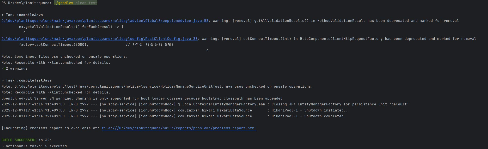
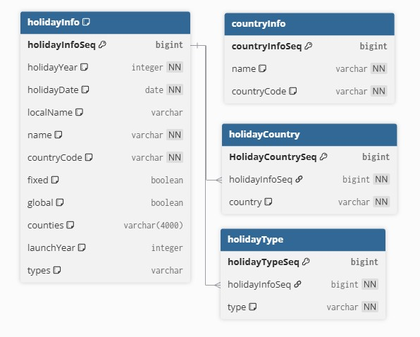

# 공휴일 데이터 관리 시스템

## 1. 빌드 및 실행방법
* 필요 사항
  * JAVA 21 이상
* 실행 방법  
    ```bash
  #빌드 Gradle 명렁어
  ./gradlew bootJar
  #실행 Gradle 명렁어
  ./gradlew bootRun
  #배포 Jar 파일 실행 명렁어
    java -jar holiday-management-system-0.0.1-SNAPSHOT.jar
    ```
  
## 2. API 명세
[API 명세](doc/apiDoc.md)

## 3. test 성공 스크린샷


## 4. Swagger UI 접근 URl
* 1. ./gradlew bootRun 명령 실행하여 Server 구동 
* 2. 웹브라우저에서 아래 URL 접속
  * http://localhost:8080//swagger.html

## 5. ERD

